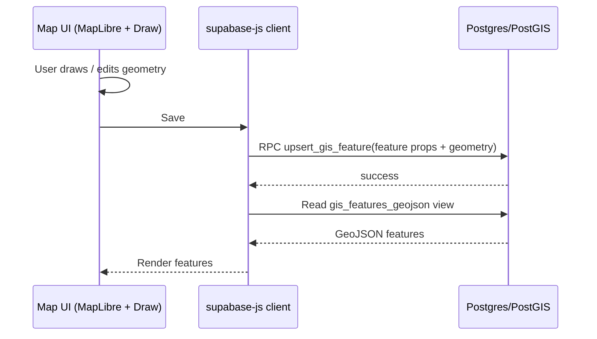
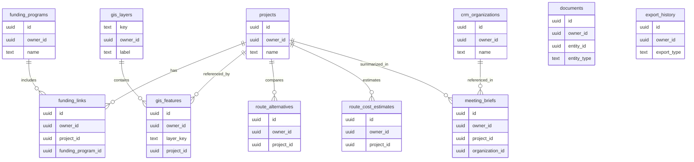
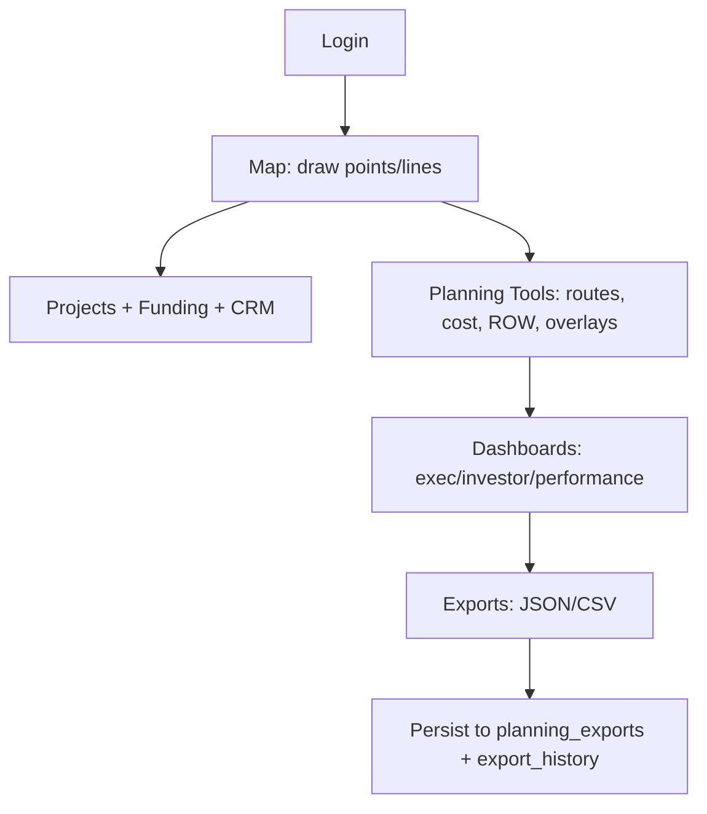

# RGV Water GIS Command Center — System Architecture

This document explains the system’s architecture, data model, and GIS data flow.

---

## 1) High-Level Architecture

### 1.1 Components
- **Client (Browser)**: React UI (Next.js App Router) rendering the Map, Planning Tools, and Dashboards.
- **App Server (Next.js)**: Serves the web app and handles auth-gated routing via Supabase SSR helpers.
- **Supabase**:
  - **Auth**: email/password login
  - **Postgres + PostGIS**: core relational + geospatial persistence
  - **Storage**: documents, uploads, export artifacts

### 1.2 System diagram

```mermaid
flowchart LR
  U[User Browser] -->|HTTPS| A[Next.js Web App]
  A -->|supabase-js (client)| S[Supabase API]

  subgraph Supabase
    S --> DB[(Postgres + PostGIS)]
    S --> ST[(Storage Buckets)]
    S --> AU[Auth]
  end

  A -->|Static + SSR| U
```

---

## 2) Security Model

### 2.1 Authentication
- Users sign up/sign in with Supabase Auth (email/password).

### 2.2 Authorization (RLS)
- Tables are protected with Row Level Security (RLS).
- The default access pattern is user ownership:
  - `owner_id = auth.uid()`

### 2.3 Implications
- Data is not shared across users by default.
- Collaboration features (org/project sharing) are a planned future phase.

---

## 3) GIS Architecture

### 3.1 Map rendering
- **MapLibre GL JS** renders basemap + vector overlays.
- **Mapbox Draw** is used for interactive editing of points/lines (and other geometry types in some tools).

### 3.2 Geometry storage
- Geometry is stored in PostGIS as `geometry(Geometry, 4326)`.
- GeoJSON is used as the interchange format in the frontend.

---

## 4) Data Flow (GIS Features)

### 4.1 GIS feature lifecycle



### 4.2 GIS exports
- GeoJSON exports are generated client-side from the in-memory feature set.

---

## 5) Planning Tools Architecture

### 5.1 File Uploads
- Stored in Storage bucket `planning_uploads`.
- Metadata stored in `uploaded_files`.

### 5.2 Imported Layers
- Imported layer record stored in `imported_layers`.
- Per-feature geometries stored in `imported_geometries`.
- A GeoJSON retrieval RPC (`get_imported_layer_geojson`) returns a FeatureCollection for rendering.

### 5.3 Map Overlays
- Overlay source images stored in `planning_uploads`.
- Overlay configuration stored in `map_overlays` (including `corners` for image georeferencing).
- The app renders overlays using a MapLibre `image` source + `raster` layer.

### 5.4 ROW Corridors
- Stored in `row_corridors` as arbitrary geometry (point/line/polygon).
- Edited via map drawing tools.

### 5.5 Route Alternatives
- Stored in `route_alternatives` as LineString per project.
- Map drawing UI plus metadata fields; length computed client-side via Turf.

### 5.6 Cost Estimator
- Stored in `route_cost_estimates`.
- Dashboards use the latest row per project to compute estimated capex.

---

## 6) Dashboards Architecture

### 6.1 Dashboards data sources
- **Projects**: `projects` (Phase 2)
- **Funding deadlines**: `funding_programs` (Phase 2)
- **CRM follow-ups**: `crm_meetings`, `crm_notes` (Phase 2; follow_up_at)
- **Capex estimates**: latest `route_cost_estimates` per project (Phase 3)

### 6.2 Meeting briefs
- Stored in `meeting_briefs` (Phase 4).

---

## 7) Export Persistence

### 7.1 Storage
- Persisted exports are uploaded to `planning_exports`.

### 7.2 Export history
- `export_history` records metadata about exports, including parameters and storage path.

---

## 8) Database Model (Tables and Relationships)

> Canonical definitions live in the SQL migrations:
> - `supabase/schema.sql`
> - `supabase/phase2.sql`
> - `supabase/phase3.sql`
> - `supabase/phase4.sql`

### 8.1 Phase 1 tables
- `gis_layers`: user-managed layers (label + color).
- `gis_features`: PostGIS features with per-feature metadata and a layer key.
- `gis_features_geojson` (view): GeoJSON representation for frontend reads.

### 8.2 Phase 2 tables
- `projects`: project portfolio records (name, status, priority, estimated_mgd, revenue, etc.).
- `crm_organizations`: stakeholder organizations.
- `crm_contacts`: contacts (table exists; UI expansion planned).
- `crm_meetings`: meetings (table exists; dashboards read follow_up_at).
- `crm_notes`: notes (table exists; dashboards read follow_up_at).
- `funding_programs`: funding programs (deadlines drive Executive Summary).
- `funding_links`: link projects to funding programs.
- `documents`: document metadata (stored in Storage bucket `documents`).

### 8.3 Phase 3 tables
- `uploaded_files`: metadata for `planning_uploads` objects.
- `imported_layers`: imported layer metadata.
- `imported_geometries`: imported features (geometry + properties JSON).
- `map_overlays`: overlay metadata including `corners` and opacity.
- `overlay_control_points`: control points scaffold.
- `row_corridors`: ROW corridor geometries.
- `route_alternatives`: A/B/C line alternatives per project.
- `route_cost_estimates`: cost estimate rows per project.
- `export_jobs`: scaffold for future job-driven export pipeline.

### 8.4 Phase 4 tables
- `project_scenarios`: scenario definitions (database-ready).
- `scenario_utilities`: scenario utility attachments.
- `scenario_routes`: scenario route attachments.
- `revenue_models`: revenue model assumptions (database-ready).
- `risk_register`: risk entries (database-ready).
- `meeting_briefs`: saved briefs (Legislative Briefs UI).
- `dashboard_snapshots`: snapshot storage scaffold.
- `export_history`: history of persisted exports.

### 8.5 Relationship diagram (conceptual)



---

## 9) User Workflow Diagram



---

## 10) Deployment Architecture Notes

### 10.1 Client vs server
- Most reads/writes are performed from the browser using `@supabase/supabase-js`.
- RLS policies are critical because the client holds the anon key.

### 10.2 Scaling considerations
- Imported layers are capped (5000 features) to keep client rendering responsive.
- For large layers, consider a tiling/vector-tile approach in a future phase.
